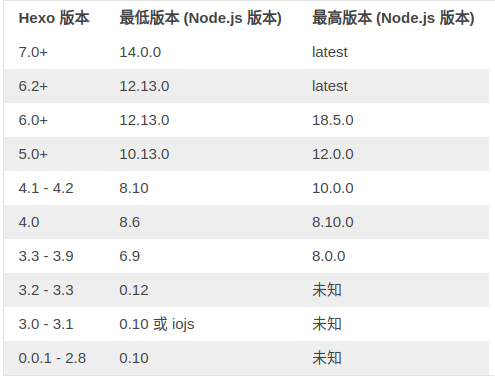

# Install

Refer to [Hexo Docs](https://hexo.io/zh-cn/docs/)

Node modules and butterfly theme are not in the repository, so need to install them separately.

## Ubuntu

Refer to [Butterfly Install](https://butterfly.js.org/posts/21cfbf15/)



```bash
sudo apt-get install git

# Clone the repository, first set ssh correct
git clone git@github.com:Judera9/Blogs.git
# git clone https://github.com/Judera9/Blogs.git # Need to set token

# Install nvm for Managing Node.js Versions
wget -qO- https:/****/raw.githubusercontent.com/nvm-sh/nvm/v0.40.1/install.sh | bash 
source ~/.bashrc
nvm install 18
nvm use 18

# Install Hexo
npm install -g hexo-cli

# Install Butterfly Theme
git clone -b master https://github.com/jerryc127/hexo-theme-butterfly.git themes/butterfly
npm install hexo-renderer-pug hexo-renderer-stylus --save

```

Test for Install, you can see the result in the browser with link [http://localhost:4000](http://localhost:4000).

```bash
hexo clean
hexo g # hexo generate
hexo s # hexo server
```

## Windows

TODO


# Install Dependencies

TODO
